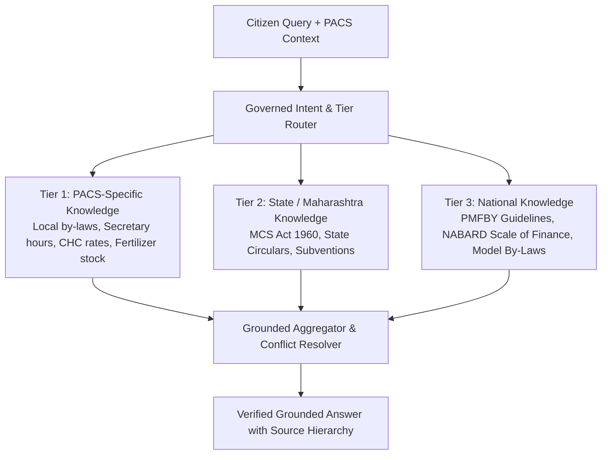
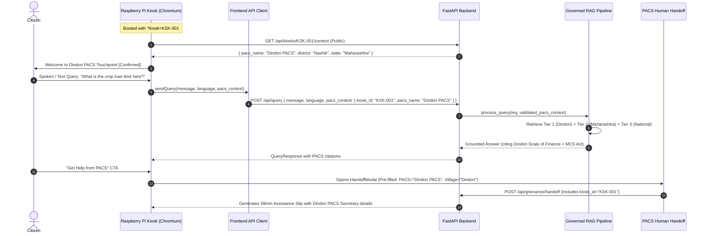
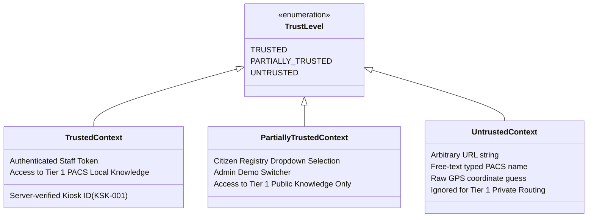
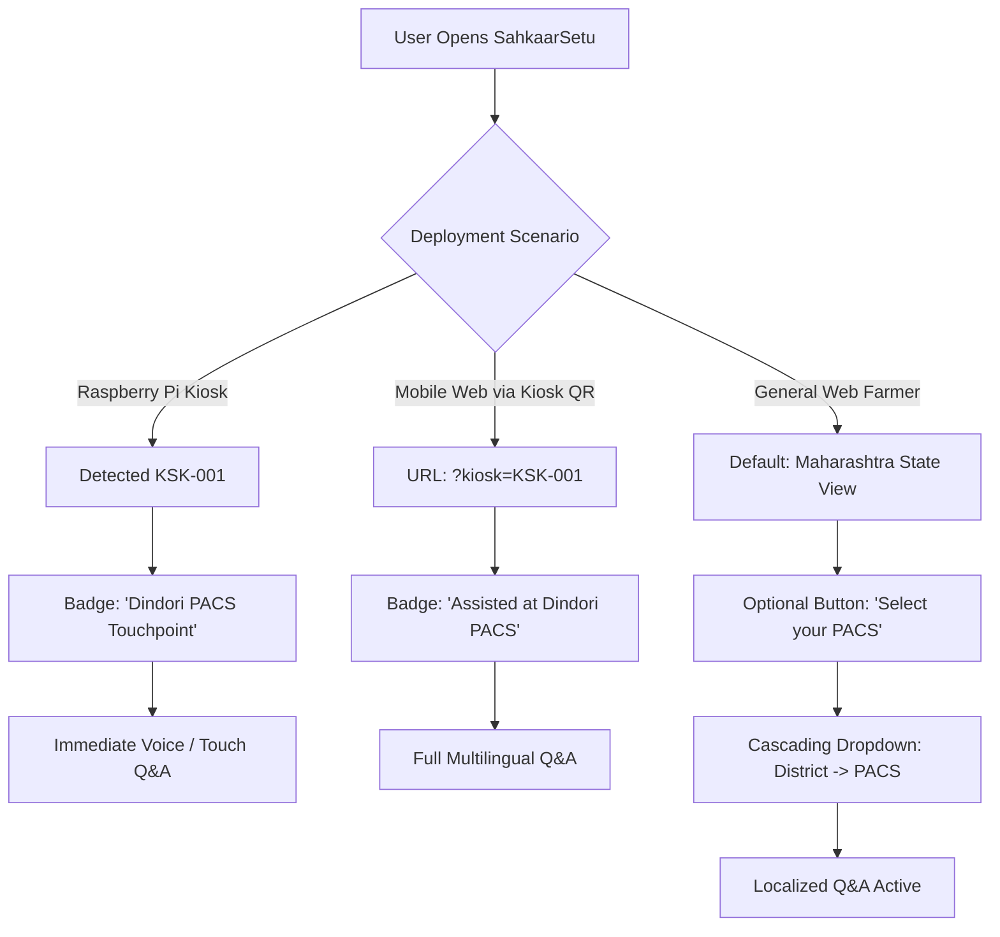

# CITIZEN PHASE 3B — PACS CONTEXT ARCHITECTURE AUDIT

**Project**: SahkaarSetu / Cooperative AI (SIH26088)  
**Phase**: Citizen Phase 3B — PACS Context Architecture Audit  
**Date**: 2026-09-13  
**Status**: COMPLETE (AUDIT REPORT ONLY — ZERO CODE MODIFICATIONS)  
**Final Verdict**: `READY — PACS CONTEXT CAN BE ADDED SAFELY`

---

## 1. Executive Summary

SahkaarSetu (SIH26088) addresses the challenge of empowering 130+ million rural cooperative members through AI-powered, voice-enabled assistance. The current production and prototype implementation delivers verified multilingual Q&A (English, Hindi, Marathi) backed by governed RAG (Retrieval-Augmented Generation) and facilitation handoff ("Get Help from PACS") with 58mm thermal slips and QR verification.

However, the existing system answers queries primarily from **generic National and State-level knowledge** (e.g., *Model By-Laws for Primary Agricultural Credit Societies 2022*, *Maharashtra Cooperative Societies Act 1960*, *PMFBY Operational Guidelines*). When a farmer stands in front of a rural Raspberry Pi touchscreen kiosk at **Dindori Primary Agriculture Cooperative Society (Nashik)** or **Baramati Taluka Sahakari Sangh (Pune)**, the AI currently has **zero awareness** of:
1. Which specific PACS touchpoint the citizen is visiting.
2. The local PACS society's specific scale of finance, custom hiring equipment rates, or active fertilizer/seed stock.
3. The local village, taluka, and district administrative jurisdiction.

The objective of **Citizen Phase 3B** is to audit the entire full-stack architecture and establish the exact roadmap for safely introducing **real, verified PACS context** from hardware kiosks into the AI reasoning and retrieval pipeline—**without breaking existing query contracts, without exposing private data, and without altering the Admin portal**.

---

## 2. Current PACS Context Inventory

Every PACS- and location-related field across backend, frontend, database, and knowledge base was audited:

| Field | Current Classification | Location / File | How Populated | Persisted? | Trustworthy for RAG? |
|---|---|---|---|---|---|
| `pacs_id` | **NOT FOUND** | Nowhere in DB or code | N/A | No | N/A (Does not exist) |
| `pacs_name` (Kiosks) | **EXISTS + REAL** | `backend/database/migration_phase2a_kiosks.sql`, `repository.py` | Admin seed & database column `kiosks.pacs_name` | Yes (`kiosks` table) | **Yes** (Server-controlled) |
| `pacs_name` (Grievances) | **EXISTS + DEMO/MOCK** | `grievances.pacs_name`, `HandoffModal.tsx` | Citizen free-text input in modal | Yes (`grievances` table) | **No** (Unsanitized user string) |
| `pacs_name` (Admin Users) | **EXISTS + REAL** | `users.assigned_pacs`, `admin_auth.py` | Admin operator assignment | Yes (`users` table) | **Yes** (Admin controlled, but string only) |
| `PACS registration number` | **NOT FOUND** | Nowhere in DB or code | N/A | No | N/A |
| `district` (Kiosks) | **EXISTS + REAL** | `kiosks.district`, `admin_kiosk.py` | Admin fleet configuration | Yes (`kiosks` table) | **Yes** (Server-controlled) |
| `district` (Location Service) | **EXISTS + DEMO/MOCK** | `frontend/src/services/locationService.ts` | Browser Geolocation reverse geocoding | In-memory only (Never sent to API) | **No** (Unverified GPS estimate) |
| `taluka` | **NOT FOUND** | Only mentioned in UI placeholder strings | N/A | No | N/A |
| `village` | **EXISTS + DEMO/MOCK** | `HandoffCreateRequest.village`, `grievances.village` | Citizen free-text input in handoff modal | Yes (`grievances` table) | **No** (Unvalidated free text) |
| `state` | **EXISTS + REAL** | `kiosks.state`, `session_state.py`, `retriever.py` | Defaulted to "Maharashtra" in DB and RAG | Yes | **Yes** (Strictly bounded) |
| `kiosk_id` | **EXISTS + REAL (Backend)** | `kiosks.id`, `POST /api/kiosks/{id}/heartbeat` | Machine-to-machine hardware identifier | Yes (`kiosks` table) | **Yes** (Hashed key authenticated) |
| `kiosk_id` (Frontend) | **NOT FOUND** | Nowhere in `frontend/src/` | N/A | No | N/A (Frontend has no kiosk state) |
| `Sahkaar ID` | **NOT FOUND** | Nowhere in codebase | N/A | No | N/A |
| `cooperative society code` | **NOT FOUND** | Nowhere in codebase | N/A | No | N/A |
| `member ID` | **NOT FOUND** | Nowhere in codebase | N/A | No | N/A |
| `staff ID` | **NOT FOUND** | Unnormalized `assigned_staff` text only | N/A | No | N/A |
| `kiosk location` | **EXISTS + REAL** | `kiosks.location` (e.g. "Dindori Road, Nashik") | Admin hardware registry | Yes (`kiosks` table) | **Yes** (Administrative metadata) |
| `latitude/longitude` | **EXISTS + REAL (Frontend)** | `locationService.ts`, `LocationModal.tsx` | `navigator.geolocation.getCurrentPosition` | In-memory only (Never sent to API) | **No** (Client-side only) |
| `selected PACS` | **NOT FOUND** | Nowhere in frontend app state | N/A | No | N/A |
| `detected PACS` | **NOT FOUND** | Nowhere in frontend app state | N/A | No | N/A |
| `logged-in staff PACS context` | **EXISTS + REAL (Admin)** | `users.assigned_pacs`, `admin_auth.py` | JWT claim parsed by `get_current_admin_user` | Yes (`users` table) | **Yes** (Admin-only RBAC scope) |

---

## 3. Current Kiosk Architecture

### What Exists Today
1. **Database Schema (`kiosks` table)**:
   - Contains: `id` (e.g. `KSK-001`), `name`, `location`, `district`, `state`, `pacs_name`, `status`, `health` (JSONB), `api_key_hash` (SHA-256), `last_heartbeat`.
   - Populated with 4 seed records in `repository.py`:
     - `KSK-001`: Nashik Central PACS Kiosk → Dindori PACS, Nashik
     - `KSK-002`: Baramati Cooperative Touchpoint → Baramati Taluka Sangh, Pune
     - `KSK-003`: Kolhapur Dudh Sahakari Point → Shirol Dairy Society, Kolhapur
     - `KSK-004`: Nashik DCCB Touchpoint → Nashik District Central Bank
2. **Device Telemetry (`POST /api/kiosks/{kiosk_id}/heartbeat`)**:
   - Machine-to-machine authenticated via `X-Kiosk-Key` or Bearer token against stored SHA-256 hash.
   - Updates hardware diagnostics, printer status, and network state.
3. **Admin Fleet Management (`GET /api/admin/kiosks`)**:
   - Protected by Admin/Staff JWT with RBAC (Staff can only view kiosks in their assigned PACS).

### What Is Missing for Citizen Touchpoint Operation
1. **Public Kiosk Context Resolution Endpoint**:
   - There is currently **no endpoint** allowing a kiosk browser or citizen to request:
     `GET /api/kiosks/{kiosk_id}/context` → Returns public info: `{ pacs_name, district, state, location, status }`.
   - Existing GET routes require Admin JWT tokens.
2. **Citizen Frontend Kiosk State**:
   - The Citizen web application has no URL parameter parser (e.g. `?kiosk=KSK-001`), no kiosk context state, and no local device persistence.
3. **Query Pipeline Integration**:
   - Neither `POST /api/query` nor `POST /api/voice/query` accepts a `kiosk_id` or `pacs_context` object.
   - `process_user_query` receives only `message`, `language`, `session_id`, `response_mode`.
4. **Session State Isolation**:
   - `SessionState` in `rag/session_state.py` tracks only `turn_number`, `topic`, `user_goal`, and `collected_slots` (state, crop). It has no concept of PACS identity.

---

## 4. Evaluation of Potential PACS Context Sources

| Source | Feasibility | Security | Reliability | Complexity | Suitable for SIH Prototype? | Suitable for Production? |
|---|---|---|---|---|---|---|
| **A. Physical Kiosk Provisioning** | **High** | **High** | **High** | Low | **Yes (Recommended)** | **Yes** |
| **B. Kiosk ID via URL Param (`?kiosk=KSK-001`)** | **High** | **Medium-High** (if server-verified) | **High** | Low | **Yes (Recommended)** | Yes (for browser boot) |
| **C. QR Code attached to Kiosk** | **High** | **Medium** | **High** | Low | **Yes** | **Yes** |
| **D. Admin-Configured Host PACS** | **High** | **High** | **High** | Low | **Yes** | **Yes** |
| **E. Citizen Manual Selection (Dropdown)** | **High** | **Medium** | **Medium** | Low-Med | **Yes (for Web users)** | **Yes** |
| **F. Browser GPS / Geolocation** | Medium | **Low** (Spoofable) | **Low** (Rural GPS error) | Medium | No (Assistive suggestion only) | No (Unreliable) |
| **G. Free-Text Typed by Citizen** | High | **Low** (Hallucinations) | **Very Low** (Typos) | Low | No (Never trust for RAG) | No |
| **H. National Sahkaar ID** | **Zero** | High | High | Very High | **No (Does not exist)** | Long-term Govt Policy |
| **I. Staff Login / PIN** | Medium | High | High | Medium | No (Kiosk is self-service) | Optional Staff Mode |
| **J. Device `localStorage`** | **High** | Medium | High | Very Low | **Yes (Kiosk boot cache)** | **Yes** |

**Recommendation**:
- For **Raspberry Pi Kiosks**: Use **Source A + B** (Fixed kiosk ID configured in kiosk browser startup URL, validated server-side against the `kiosks` table).
- For **Citizen Mobile / Web**: Use **Source C** (Scan kiosk QR when at society) or **Source E** (Cascading dropdown: State → District → PACS).
- **Reject Source F and G** as authoritative RAG inputs.

---

## 5. Current Knowledge Metadata & RAG Tiering Readiness

### Current Metadata Architecture
`LOCAL_KNOWLEDGE_DOCUMENTS` (in `rag/retriever.py`) and files in `knowledge_base/` currently provide:
- `authority_level`: `CENTRAL_GOVERNMENT` | `STATE_GOVERNMENT`
- `jurisdiction`: `INDIA` | `MAHARASHTRA`
- `applicability`: `["PACS"]` | `["HOUSING"]` | `["ALL_COOPERATIVES"]`
- `precedence_tier`: `100` (Acts), `60` (By-laws), `50` (Schemes/FAQs)
- `year`: Statutory publication year

### The Missing PACS Knowledge Layer
There are currently **zero knowledge chunks** indexed with a specific PACS identifier. All PACS chunks in the system represent **generic Model By-Laws or NABARD credit manuals**.

### Proposed 3-Tier Governed Knowledge Routing



#### Precedence & Conflict Rules:
1. **Tier 1 (PACS-Specific)**: Highest precedence on *operational facts* (e.g. Society office hours, custom hiring tractor rental rates, local stock availability, specific subvention add-ons).
2. **Tier 2 (State Law)**: Highest precedence on *statutory compliance* (e.g. MCS Act 1960 audit mandates, maximum transfer fees, cooperative dispute filing procedures). Tier 1 cannot override Tier 2 law.
3. **Tier 3 (National Guidelines)**: Baseline fallback for nationwide schemes (PMFBY 72-hour crop loss deadline, NABARD KCC interest subvention formula).
4. **Missing-Context Fallback**: If a citizen asks a question without PACS context (or Tier 1 has no matching records), retrieval executes across Tier 2 and Tier 3 exactly as it does today. **Zero regression**.

---

## 6. End-to-End Context Propagation Design



### Proposed Smallest Safe Context Schema (`PACSContext`)

```python
class PACSContext(BaseModel):
    kiosk_id: Optional[str] = Field(default=None, max_length=32)
    pacs_name: Optional[str] = Field(default=None, max_length=250)
    district: Optional[str] = Field(default=None, max_length=100)
    state: str = Field(default="Maharashtra", max_length=100)
    source: Literal["kiosk_verified", "admin_demo", "citizen_selected", "unverified_gps"] = "kiosk_verified"
    trust_level: Literal["TRUSTED", "PARTIALLY_TRUSTED", "UNTRUSTED"] = "TRUSTED"
```

---

## 7. Security Trust Model

To prevent unauthorized access, cross-society data leakage, or spoofing, every incoming PACS context claim must be classified and handled according to strict trust tiers:



### Critical Security Invariant
> **The Anti-Poaching Rule**: An untrusted or client-tampered `pacs_name` in a query request must **NEVER** unlock proprietary society audit logs, private member registries, or confidential board minutes of another PACS. If a context claim cannot be validated against the server-side `kiosks` table or official registry, it must be treated strictly as an informational topic hint, routing exclusively to public Tier 2/Tier 3 state and national guidance.

---

## 8. Sahkaar ID Recommendation

The Problem Statement mentions cooperative identity. Our architecture audit reveals:
1. **No official national API exists** today for real-time verification of rural farmer PACS membership across states.
2. **Attempting to invent a pseudo-Aadhaar or fake government credential** would violate SIH submission rules and introduce severe security/regulatory vulnerabilities.
3. **Recommendation**:
   - **Do NOT introduce a pseudo "Sahkaar ID" identity token in Phase 3B**.
   - Instead, treat the **Assistance Slip Reference Code** (`PACS-2026-XXXXXX`) and **Kiosk Asset ID** (`KSK-001`) as operational reference handles.
   - If a citizen has an existing Kisan Credit Card (KCC) or PACS Passbook number, allow them to optionally quote it in the human handoff facilitation notes without enforcing server-side identity verification.

---

## 9. Citizen UX Recommendations Across Deployment Scenarios



### Edge Cases Handled Safely:
1. **Unknown Kiosk ID**: If kiosk ID is invalid, fallback cleanly to General Maharashtra State mode with a subtle notice: *"Touchpoint unverified — showing state guidance"*.
2. **GPS Denied by Citizen**: Zero impact. Citizen continues unhindered; language and intent remain primary drivers.
3. **PACS Mismatch**: If citizen in Dindori PACS asks about Baramati rules, the AI answers using general state law and notes: *"You are at Dindori PACS, but this rule applies across Maharashtra cooperative societies."*

---

## 10. Human Handoff Integration (Phase 3A → 3B Enrichment)

In Phase 3A, `HandoffModal.tsx` required the citizen to manually type their PACS name and village. In Phase 3B:
- When running with verified PACS context, `HandoffModal` **auto-populates** `pacs_name`, `district`, and `village`.
- The generated `AssistanceSlipData` includes the verified `kiosk_id` and official society address.
- The 58mm Assistance Slip header clearly identifies the host society:
  `SAHKAARSETU PACS ASSISTANCE REFERENCE SLIP — DINDORI PACS (NASHIK)`.
- Existing backend `/api/grievance/handoff` continues to accept the same payload, enriched with verified PACS strings.

---

## 11. Security & Threat Audit

| Threat | Impact | Concrete Mitigation |
|---|---|---|
| **PACS Impersonation** | Malicious actor claims to be another society to access data | Kiosk ID must be validated against `kiosks` table; private data is never exposed over query endpoint. |
| **Kiosk ID Spoofing** | Attacker appends `?kiosk=KSK-001` to browser | Context is marked `PARTIALLY_TRUSTED`; only public Tier 1 knowledge is returned. Sensitive staff operations require JWT. |
| **Cross-PACS Data Leakage** | Farmer at PACS A sees grievances from PACS B | Citizen query responses only search knowledge documents, never grievances or private user records. |
| **Location / GPS Spoofing** | Citizen fakes GPS coordinates | GPS is never used for security boundaries; it is only an optional hint to sort dropdown lists. |
| **Denial of Service via Heartbeats** | Flooding M2M endpoint | Heartbeat requires SHA-256 pre-shared key check in `kiosks.py` before executing any DB writes. |

---

## 12. SIH MVP vs. Production Architecture Comparison

| Component | SIH Demo / MVP Design | Full Production Target |
|---|---|---|
| **Kiosk Identity** | Registered in `kiosks` table, referenced by `KSK-001` URL param | TPM 2.0 hardware attestation / Mutual TLS certificate per Raspberry Pi |
| **PACS Master Data** | 4–6 Representative PACS across Maharashtra in database | National Cooperative Database (NCD) API integration with 100,000+ PACS |
| **Local Knowledge** | Local JSON documents for Dindori and Baramati PACS | Society-level document ingestion portal with DDR sign-off |
| **Hardware Enclosure** | Raspberry Pi 4/5 + Touchscreen + USB Mic + 58mm Thermal Printer | Ruggedized IP65 dust-proof kiosk kiosk housing with solar UPS |
| **Offline Capability** | Client-side standalone knowledge fallback | On-device Ollama/Gemma-2B quantized model running on Raspberry Pi 5 |

---

## 13. Staged Implementation Plan for Future Execution

The implementation must be strictly decomposed into safe, additive sub-phases:

```
Phase 3B.1: PACS Registry & Metadata Foundation (DB & Schemas)
Phase 3B.2: Public Kiosk Context Resolution API (GET /api/kiosks/{id}/context)
Phase 3B.3: Query Contract Context Extension (Additive QueryRequest.pacs_context)
Phase 3B.4: Governed 3-Tier RAG Retriever Routing (PACS -> State -> National)
Phase 3B.5: Citizen UI Kiosk Detection & Context Bar (Frontend)
Phase 3B.6: Human Handoff & 58mm Slip Enrichment
Phase 3B.7: End-to-End Hardware Kiosk Verification & Regression Test Suite
```

### Stage Details & Safety Boundaries:

#### Stage 3B.1: PACS Registry & Metadata Foundation
- **Changes**: Additive table or view for PACS societies (`pacs` table with `id`, `name`, `district`, `taluka`, `state`).
- **Safety**: Does not alter existing `kiosks` or `grievances` tables; adds optional foreign keys or lookup mappings.

#### Stage 3B.2: Public Kiosk Context Resolution API
- **Changes**: Add `GET /api/kiosks/{kiosk_id}/public` in `backend/app/api/routes/kiosks.py`.
- **Safety**: Unauthenticated, read-only, returns ONLY public metadata (`pacs_name`, `district`, `state`, `location`). Never exposes `api_key_hash` or internal notes.

#### Stage 3B.3: Query Contract Context Extension
- **Changes**: Add optional `pacs_context: Optional[PACSContext] = None` to `QueryRequest` in `query.py`.
- **Safety**: 100% backwards-compatible. When omitted, queries behave identically to today.

#### Stage 3B.4: Governed 3-Tier RAG Retriever Routing
- **Changes**: In `rag/retriever.py`, if `pacs_context` is present, boost/filter Tier 1 chunks matching `pacs_name` or `pacs_id`.
- **Safety**: When no Tier 1 chunks match, falls back to existing Tier 2 and Tier 3 retrieval without any change in output structure.

#### Stage 3B.5: Citizen UI Kiosk Detection & Context Bar
- **Changes**: In `frontend/src/App.tsx`, check `window.location.search` for `kiosk=KSK-XXX`. If present, fetch context and render subtle header badge: `🏛️ Dindori PACS Touchpoint`.
- **Safety**: Normal web users without URL param see standard interface.

#### Stage 3B.6: Human Handoff & 58mm Slip Enrichment
- **Changes**: Auto-fill `pacs_name` and `village` in `HandoffModal.tsx` from active `pacs_context`.
- **Safety**: User can still edit or override fields before submission.

#### Stage 3B.7: Verification & Regression Testing
- **Changes**: Create `frontend/scripts/test_pacs_context.ts` and `backend/scripts/test_pacs_context_backend.py`.
- **Safety**: Verify 100% pass on all existing test suites.

---

## 14. Files That Must Remain Frozen

The following files must **NOT be modified** during Phase 3B planning and must be protected by strict regression guards during subsequent execution:

1. **Admin Portal Repository**: `/Users/pranav/Sarkar Setu Admin` (Entire repository remains FROZEN).
2. **Core AI Providers**:
   - `backend/app/providers/gemini_provider.py`
   - `backend/app/providers/bhashini_provider.py`
   - `backend/app/providers/groq_provider.py`
3. **Existing Audio & STT Routes**:
   - `backend/app/api/routes/voice.py`
4. **Existing Human Handoff Core**:
   - `backend/app/api/routes/grievance.py` (`create_human_handoff` core persistence logic)
   - `frontend/src/utils/qrGenerator.ts`
   - `frontend/src/components/AssistanceSlipView.tsx`

---

## 15. Regression Protection & Test Coverage

Before any code for Phase 3B is committed in subsequent phases, all existing test suites must continue to pass at 100%:

```bash
# 1. Phase 3A.3 58mm Slip & QR Suite
node --experimental-strip-types frontend/scripts/test_handoff_slip.ts

# 2. Phase 3A.2 UI Regression Suite
node --experimental-strip-types frontend/scripts/test_handoff_ui.ts

# 3. Backend Human Handoff Suite
backend/.venv/bin/python3 backend/scripts/test_human_handoff_backend.py

# 4. Bhashini Multilingual Voice Suite
backend/.venv/bin/python3 backend/scripts/test_bhashini_voice_integration.py

# 5. Core Citizen Regression Suite
backend/.venv/bin/python3 backend/scripts/test_citizen_regression.py

# 6. Production Frontend Build
cd frontend && npm run build
```

---

## 16. Final Verdict

```
================================================================================
VERDICT: READY — PACS CONTEXT CAN BE ADDED SAFELY
================================================================================
```

The audit confirms that the existing database architecture already contains the essential foundation (`kiosks` table with `pacs_name` and `district` mappings, M2M telemetry, and RBAC isolation). Introducing real PACS context into the citizen journey can be accomplished via purely **additive, non-breaking stages** that preserve all existing query, voice, and handoff contracts.
